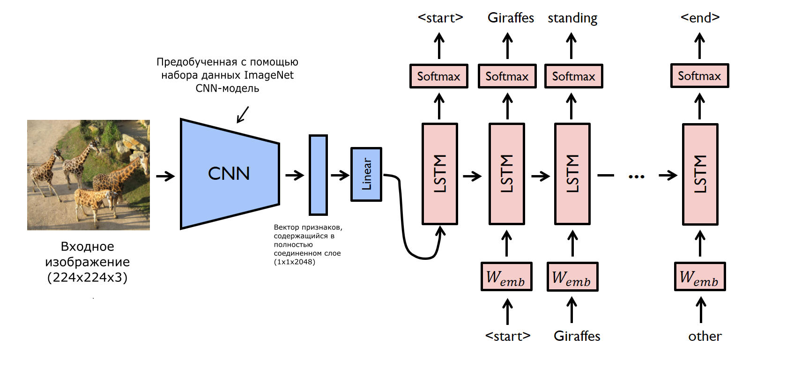

## Описание архитектуры

Генератор подписей к входным изображениям будет представлять собой ансамбль из двух нейросетей - CNN и LSTM.

Идея работы ансамбля заключается в том, что на вход к CNN подается цветное изображение (размеры которого предварительно
сделали 224 на 224 пикселя). В качестве CNN будет использоваться модель GoogleNetv3, предобученная на датасете 2015-го
года ImageNet. Получая на вход изображение в виде тензора, она будет пропускать его через все свои слои, и из последнего
полностью соединенного слоя нейросети будет браться некоторый вектор, который впоследствии преобразуется с помощью
линейного слоя. Таким образом, CNN в данной архитектуре будет являться своего рода кодировщиком, выдавая для каждого
конкретного изображения некоторый вектор.

Полученный обработанный вектор отправляется на вход нейросети LSTM, которая (с учетом определенного словаря, количества
lstm-слоев и прочих гиперпараметров) будет создавать последовательные связанные друг с другом слова. Это делает
LSTM-модель своего рода декодировщиком, результатом деятельности которого будет подпись к изображению.

## Изображение схемы архитектуры

## Файлы

**get_loader.py** - файл, который содержит классы Vocabulary, Dataset, DataLoader, обеспечивающие предобработку изображений
и тренировочных подписей с последующей загрузкой их в нейросеть для обучения и теста.

**model.py** - содержит описание класса модели машинного обучения, который представляется ансамблем из вышеупомянутых CNN и
LSTM.

**train.py** - проводит окончательную предобработку данных, вводит гиперпараметры и осуществляет обучение ансамбля, сохраняя
веса нейросети каждые 10 эпох. Здесь также осуществляется формирование изображения графика функции потерь.

**split_data_script.ipynb** - небольшая тетрадь Jupyter, в которой содержится процесс разделения набора данных на тестовую и
тренировочную выборки.

**check_metric.ipynb** - содержит в себе функции, реализующие проход ансамбля по тестовой выборке, с последующей оценкой качества модели с помощью метрики "Косинусного коэффициента".

Папка **charts** содержит график зависимости значения функции потерь с увеличением количества пройденных эпох.

Папка **runs** включает в себя файлы для TensorBoard.
