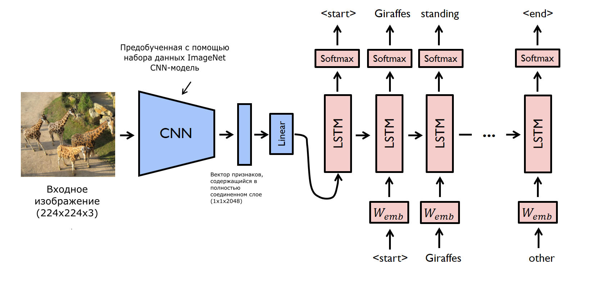

## Описание архитектуры

Генератор подписей к входным изображениям будет представлять собой ансамбль из двух нейросетей - CNN и LSTM.

Идея работы ансамбля заключается в том, что на вход к CNN подается цветное изображение (размеры которого предварительно
сделали 224 на 224 пикселя). В качестве CNN будет использоваться модель GoogleNetv3, предобученная на датасете 2015-го
года ImageNet. Получая на вход изображение в виде тензора, она будет пропускать его через все свои слои, и из последнего
полностью соединенного слоя нейросети будет браться некоторый вектор, который впоследствии преобразуется с помощью
линейного слоя. Таким образом, CNN в данной архитектуре будет являться своего рода кодировщиком, выдавая для каждого
конкретного изображения некоторый вектор.

Полученный обработанный вектор отправляется на вход нейросети LSTM, которая (с учетом определенного словаря, количества
lstm-слоев и прочих гиперпараметров) будет создавать последовательные связанные друг с другом слова. Это делает
LSTM-модель своего рода декодировщиком, результатом деятельности которого будет подпись к изображению.

## Изображение схемы архитектуры

